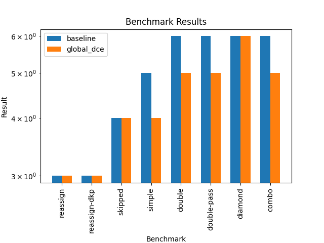
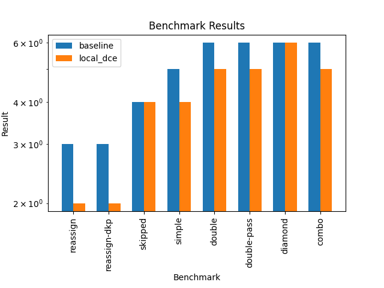
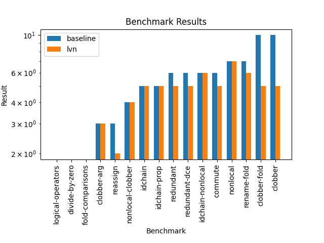

# CS265 Task 1 Local Optimizations
### Tiffany Tang (3037261885)
This reflection outlines the implementation of three optimizations within the Bril compiler infrastructure: Trivial Global Dead Code Elimination, Local Dead Code Elimination, and Local Value Numbering for CS265 Task 1 Local Optimizations. 

## How to Run

```bash
cd examples/local_opt
bril2json < ../test/tdce/simple.bril | python3 global_dce.py | brili -p # for global dce
bril2json < ../test/tdce/reassign.bril | python3 local_dce.py | brili -p # for local dce
bril2json < ../test/lvn/commute.bril | python3 lvn.py | brili -p # for lvn
```

# Trivial Global Dead Code Elimination
My [global dce](global_dce.py) implementation iterates through the instructions in a program's function and removes any instruction whose destination value is not used. The process continues until no further changes can be made (converges).

#### Benchmark result for all bril programs under 'test/tdce' directory.

Global DCE had varying effects across different benchmarks. In cases where the benchmarks involved unused variables, such as double-pass and combo, global DCE yielded clear benefits.

# Local Dead Code Elimination
My [local dce](local_dce.py) implementation aims to remove unnecessary instructions at the local block level, focusing on removing redefinitions of variables that aren't used. It first breaks down the function's instructions into basic blocks. For each block, it tracks the latest definition of each variable. If a variable is redefined without being used, the earlier definition is removed. Once all blocks are processed, the blocks are flattened back into the function, effectively removing unnecessary instructions and optimizing the code.

#### Benchmark result for all bril programs under 'test/tdce' directory.


This benchmark was first run with local DCE followed by global DCE. Compared to the previous result with only global DCE, we can see that `reassign` and `reassign-dkp` have been further optimized. This is because local DCE can detect and eliminate redefined variables, something global DCE alone cannot do.

# Local Value Numbering

My implementation for [local value numbering](lvn.py) includes the following features:

### 1. **Common Subexpression Elimination (CSE)**
   - It detects and eliminates **common subexpressions**. When an identical expression is encountered multiple times, the result of the previously computed expression is reused, avoiding redundant computations.

### 2. **Exploiting Commutativity**
   - It recognizes **commutative operations** such as **addition (`add`)** and **multiplication (`mul`)**. It sorts the operands for these operations to ensure that equivalent expressions.

### 3. **Semantic Awareness of the 'id' Operation**
   - It handles the **`id` operation** that used for assigning one variable to another. Instead of creating redundant `id` instructions, the destination variable is replaced with the source variable.

### 4. **Tracking Variable Usage and Overwrites**
   - It tracks the last write to each variable in the block. This ensures that when a variable is reassigned, the old value is no longer incorrectly reused.

### 5. **Efficient Variable Reuse**
   - If an expression has been computed before, the previously assigned variable is reused, which reduces redundant instructions and improves performance.

## Limitations

### 1. **No Constant Folding**
   - This implementation does not perform constant folding due to time constraint.

#### Benchmark result for all bril programs under 'test/lvn' directory.


The LVN optimization is particularly effective in benchmarks like reassign, fold-comparisons, and clobber-arg, where there are clear opportunities for eliminating redundant expressions or reassignments. In some benchmarks, such as logical-operators and commute, LVN had little impact.

During the implementation of **local value numbering (LVN)**, I encountered several challenges:

### 1. **Handling the `id` Operation**
   Initially, I faced issues with redundant `id` operations, such as **`KeyError`** for missing variables. The bug was caused by incorrect variable propagation, and I resolved it by ensuring that the source variable was properly tracked and propagated.

### 2. **Tracking Variable Overwrites**
   Managing **variable overwrites** was tricky. I had to ensure that old values were properly invalidated when a variable was reassigned within a block. Without this, outdated values could be incorrectly reused, leading to inaccurate computations. I implemented tracking for the last write to each variable to avoid these issues.

# A program that I can optimize very well: *clobber.bril*

Unoptimized version:
```
@main {
  a: int = const 4;
  b: int = const 2;

  # (a + b) * (a + b)
  sum1: int = add a b;
  sum2: int = add a b;
  prod1: int = mul sum1 sum2;

  # Clobber both sums.
  sum1: int = const 0;
  sum2: int = const 0;

  # Use the sums again.
  sum3: int = add a b;
  prod2: int = mul sum3 sum3;

  print prod2;
}
```


Optimized version (after running lvn and global dce):
```
@main {
  a: int = const 4;
  b: int = const 2;
  lvn.2: int = add a b;
  prod1: int = mul lvn.2 lvn.2;
  print prod1;
}
```

### Key Optimizations

1. **Elimination of Redundant Computations**:
   - LVN identified that both `sum1` and `sum2` were computing the same expression. 
   - LVN optimized the multiplication (`prod1`). Instead of multiplying `sum1` by `sum2`, it simplifies the operation to `mul lvn.2 lvn.2`.

2. **Removal of Clobbered and Unused Variables**:
   - Global DCE removed the clobbered variables (`sum1` and `sum2` set to `const 0`). 
   - Global DCE removed the entire second set of operations (recomputing `sum3` and `prod2`), as they became redundant after running LVN.


# A program that I can't optimize: *idchain.bril*

Unoptimized version:
```
@main {
  x: int = const 4;
  copy1: int = id x;
  copy2: int = id copy1;
  copy3: int = id copy2;
  print copy3;
}
```

What I want to achieve:
```
@main {
  x: int = const 4;
  print x;
}
```
My current LVN pass doesn't optimize this program because it cannot recognize collapsing chains of id operations. To optimize this program, I need to handle identity elimination or copy propagation, which would detect and remove unnecessary id operations that propagate the same value through different variables.
