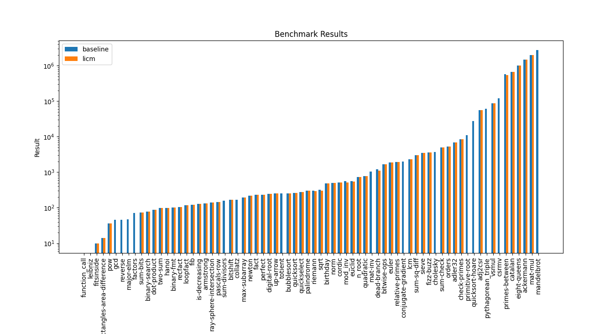

# CS265 Task 3 Loop Optimizations
### Tiffany Tang (3037261885)
This reflection outlines the implementation of Loop Invariant Code Motion (LICM) in Bril. My implementation can be found in under the same directory as this file.

## How to Run

```bash
cd examples/loop
bril2json < ./test/quadratic.bril | python3 licm.py
```

This will produce a JSON representation of the LICM version of the original program.

## Evaluation

```bash
cd examples/loop
brench brench.toml   
```

This will create a csv file with the [results of the benchmark.](./output.csv)



Here are some of the programs with big improvement with LICM:

| Program | Version | Number of Instructions |
|---------|---------|----------------|
| primes-between | baseline | 574100 |
| primes-between | licm | 534888 |
| euclid | baseline | 563 |
| euclid | licm | 544 |
| mod_inv | baseline | 558 |
| mod_inv | licm | 519 |
| riemann | baseline | 298 |
| riemann | licm | 291 |

1. **primes-between**: Reduced instructions by 6.8% (39,212 instructions)
2. **mod_inv**: Reduced instructions by 7.0% (39 instructions)
3. **euclid**: Reduced instructions by 3.4% (19 instructions)
4. **riemann**: Reduced instructions by 2.3% (7 instructions)

## Challenges and Limitations

Implementing LICM presented some challenges that deepened my understanding of compiler optimization techniques:

1. **Identifying Natural Loops**: Determining the structure of natural loops within the code was a complex task that required careful analysis of the control flow graph.

2. **Finding Loop Invariants**: This process, especially tracking reaching definitions, was challenging. It required a thorough understanding of data flow analysis and how variables are used and defined throughout the program.

3. **Filtering Movable Invariants**: Determining which loop invariants could safely be moved outside the loop without affecting program required careful consideration of various edge cases.

### Limitations and Future Improvements

A significant limitation of my current implementation is the lack of SSA form. Implementing LICM without SSA likely reduced the effectiveness of the optimization. 

For future work, to improve the effectiveness of the LICM pass, I would like to:

1. Implement SSA form to have more accurate identification of loop invariants.
2. Refine the analysis to better handle complex loop structures and nested loops.
3. Integrate LICM with other optimization passes to achieve compounded benefits.